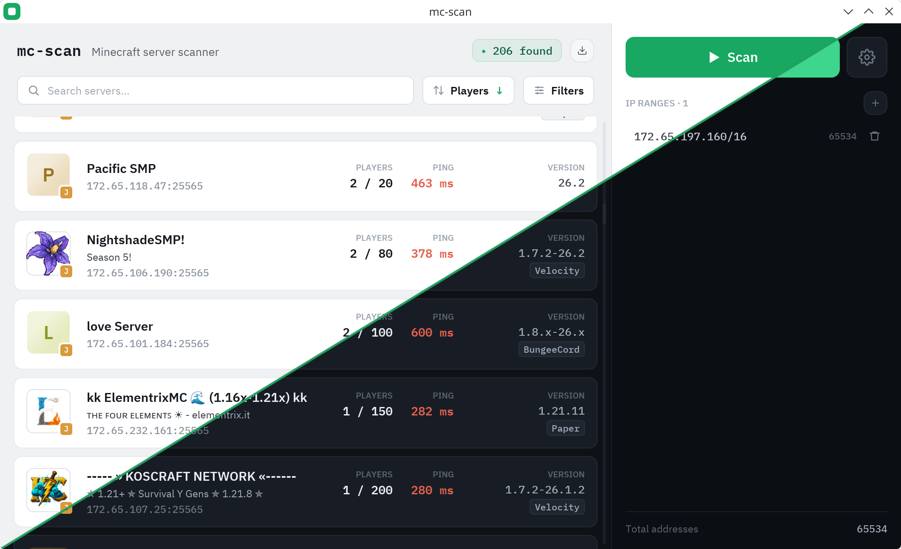
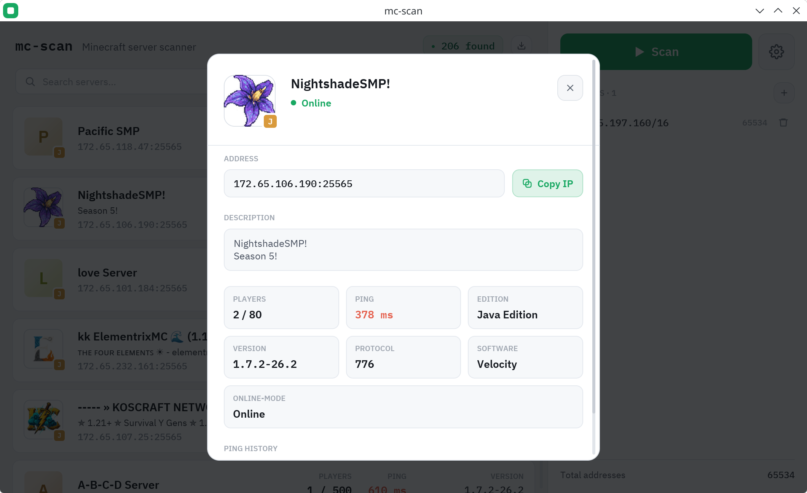

<div align="center">

# mc-scan

Minecraft server scanner — Java & Bedrock

<br/>


<br/>



</div>

<br/>

## Build

```sh
cargo build --release
```

## Usage

Enter targets in the sidebar, one per line — CIDR blocks, individual IPs, or ranges:

```
10.0.0.0/8
192.168.1.1
172.16.0.1-172.16.255.254
```

Ports, concurrency, and timeout are configurable in Settings.

<br/>

<div align="center">



</div>

